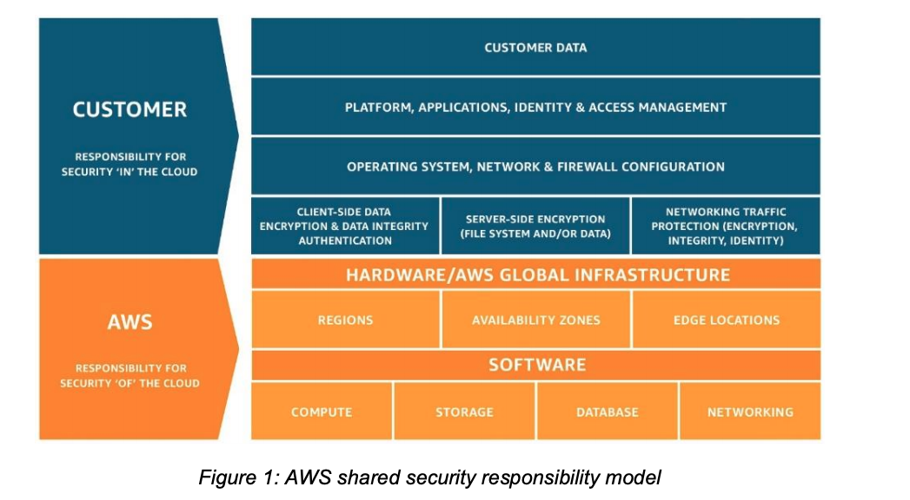

# Overview of security process
- Reference:
    - [Amazon Web Services: Overview of Security Process - 2020/03](https://d1.awsstatic.com/whitepapers/aws-security-whitepaper.pdf)

## Shared Security Responsibility Model
- AWS is responsible for securing the underlying infrastructure that supports
the cloud, and you’re responsible for anything you put on the cloud or connect to the
cloud.
- 
- AWS Security Responsibilities:
    - Protects the global infrastructure that runs all of the services offered in the AWS Cloud.
    - Provides several reports from third-party auditors who have verified AWS compliance with a variety of computer security standards and regulations.
    -  Is responsible for the
security configuration of its products that are considered managed services, such as Amazon DynamoDB, Amazon RDS, Amazon
Redshift, Amazon EMR, Amazon WorkSpaces, and several other services.
- Customer Security Responsibilities:
    - IaaS:
        - These kind of services are completely under
users' control and require users to perform all of the necessary security configuration and
management tasks.
        - Such as EC2, VPC and S3.
    - AWS managed services:
        - users should protect their AWS Account credentials and set up individual user accounts with Amazon Identity and users can implement segregation of duties.
        - e.g., Amazon RDS, Amazon Redshift.
Access Management (IAM) so that each of your users has their own credentials and
you can implement segregation of duties.
- For more information, please refer to [Best Practices for Security, Identity, & Compliance
](https://aws.amazon.com/architecture/security-identity-compliance/?cards-all.sort-by=item.additionalFields.sortDate&cards-all.sort-order=desc)

## AWS Global Infrastructure Security
### AWS Compliance Program
- AWS Compliance enables customers to understand the robust controls in place at AWS
to maintain security and data protection in the cloud.

### Business Continuity Management
#### Availability
- Data centers are built in clusters in various global regions. All data centers are online
and serving customers; no data center is “cold.” In case of failure, automated processes
move customer data traffic away from the affected area. Core applications are deployed
in an N+1 configuration, so that in the event of a data center failure, there is sufficient
capacity to enable traffic to be load- balanced to the remaining sites.
- AWS provides you with the flexibility to place instances and store data within multiple
geographic regions as well as across multiple availability zones within each region.
Each availability zone is designed as an independent failure zone.
- You should architect your AWS usage to take advantage of multiple regions and
availability zones. Distributing applications across multiple availability zones provides the ability to remain resilient in the face of most failure modes, including natural
disasters or system failures.