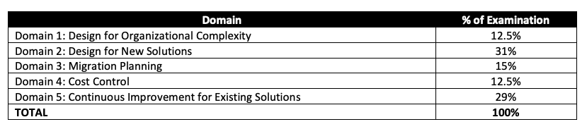

# The Note of AWS Certified Solutions Architect Professional (SAP-C01)
- [Exam Guide](https://d1.awsstatic.com/training-and-certification/docs-sa-pro/AWS-Certified-Solutions-Architect-Professional_Exam-Guide.pdf)
- It validates an examinee’s ability to:
    - Design and deploy dynamically scalable, highly available, fault-tolerant, and reliable applications on AWS.
    - Select appropriate AWS services to design and deploy an application based on given requirements.
    - Migrate complex, multi-tier applications on AWS.
    - Design and deploy enterprise-wide scalable operations on AWS.
    - Implement cost-control strategies.
- Content Outline:
    
- Exam Content
    - Response Types
    - There are two types of questions on the examination:
        - Multiple choice: Has one correct response and three incorrect responses (distractors).
        - Multiple response: Has two or more correct responses out of five or more options. 
- Score: 100 ~ 1000,  with a minimum passing score of 750.
