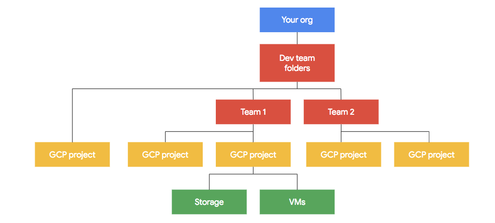

# Google Could Foundation

## Google Cloud (Hereinafter referred to as GC) Overview
- 2008:
    - Launched by Google that runs on the same infrastructure that Google uses internally for its end-user products.
    - Services: Google App Engine, Cloud Storage, Cloud SQL, K8s.
- GC provides PAAS & IAAS, e.g., computing, data storage, data analytics and machine learning.

## Design and Structure
- Global Network:
    - a global fiber network that spans:
        - regions, includes many zones, e.g., US-Central-1.
        - zones: data centers., includes many edge locations.
        - edge location: Google responses to the user's request from edge location with lowest latency.
- Security:
    - fiber network rovides a private secure global network that motly does not have to touch the internet.

## What is Google Cloud good at
- Google Security Model
- Private Fiber Global Network
- Machine Learning
- Live Migration

## Identity and Access Management (IAM)

### Functions
- Authorization
- Allows detailed document of any sequence of activities within your account. 
- Granular Access Control

### Console
- IAM & Admin
    - IAM - add/remove member
    - Roles - customize roles

## Resource Hierarchy

- [doc - Best practices for enterprise organizations](https://cloud.google.com/docs/enterprise/best-practices-for-enterprise-organizations#project-structure)

### Organization
- The Organization resource represents an organizstion and is the root node in the GC resource hierarchy.
- This serves as the hierarchical ancestor resource for Folders and Projects. With that being said, you are not required to have an organization.

### Folder
- Can serve as different depts or teams within the company

### Project
- The project organizes all your GC resources, e.g., Production Project.
- A project consists of:
    - users
    - APIs
    - billing,
    - authentication
    - monitoring settings for those APIs
