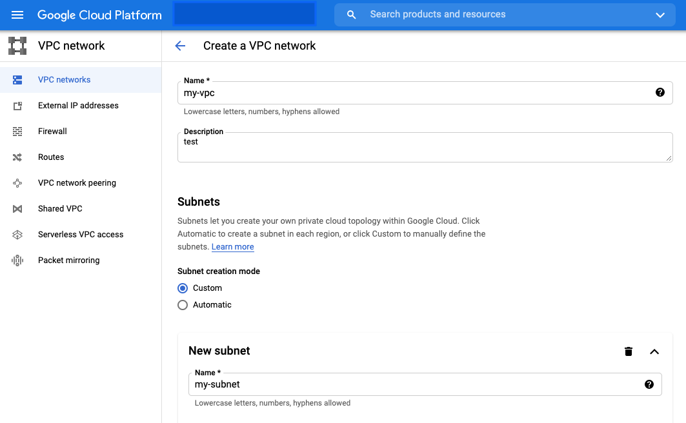
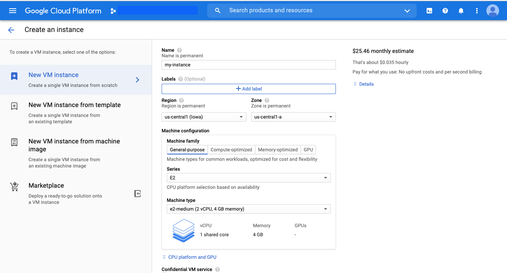

# Google Could Foundation

## Google Cloud (Hereinafter referred to as GC) Overview
- 2008:
    - Launched by Google that runs on the same infrastructure that Google uses internally for its end-user products.
    - Services: Google App Engine, Cloud Storage, Cloud SQL, K8s.
- GC provides PAAS & IAAS, e.g., computing, data storage, data analytics and machine learning.
- [Google Cloud Website](https://cloud.google.com/)

## Design and Structure
- Global Network:
    - a global fiber network that spans:
        - regions, includes many zones, e.g., US-Central-1.
        - zones: data centers., includes many edge locations.
        - edge location: Google responses to the user's request from edge location with lowest latency.
- Security:
    - fiber network rovides a private secure global network that motly does not have to touch the internet.

## What is Google Cloud good at
- Google Security Model
- Private Fiber Global Network
- Machine Learning
- Live Migration

## Identity and Access Management (IAM)

### Functions
- Authorization
- Allows detailed document of any sequence of activities within your account. 
- Granular Access Control

### Console
- IAM & Admin
    - IAM - add/remove member
    - Roles - customize roles

## Resource Hierarchy

- [doc - Best practices for enterprise organizations](https://cloud.google.com/docs/enterprise/best-practices-for-enterprise-organizations#project-structure)

### Organization
- The Organization resource represents an organizstion and is the root node in the GC resource hierarchy.
- This serves as the hierarchical ancestor resource for Folders and Projects. With that being said, you are not required to have an organization.

### Folder
- Can serve as different depts or teams within the company

### Project
- The project organizes all your GC resources, e.g., Production Project.
- A project consists of:
    - users
    - APIs
    - billing,
    - authentication
    - monitoring settings for those APIs

## Virtual Private Cloud (= AWS VPC)

- Virtual Private Cloud (VPC) network is a virtual version of a physical network, implemented inside of Google's production network.
- It associates with region.
- [Google VPC Website](https://cloud.google.com/vpc/?utm_source=google&utm_medium=cpc&utm_campaign=japac-TW-all-en-dr-bkws-all-pkws-trial-e-dr-1009882&utm_content=text-ad-none-none-DEV_c-CRE_396376275084-ADGP_Hybrid+%7C+BKWS+-+EXA+%7C+Txt+~+Networking+~+Virtual+Private+Cloud+(VPC)_virtual+private+cloud+(vpc)-general+-+Products-KWID_43700049545994499-kwd-838310732081&userloc_9040379-network_g&utm_term=KW_gcp%20virtual%20private%20cloud%20vpc&gclid=EAIaIQobChMIoeOfvOra7wIVs51LBR1XGwIBEAAYASAAEgKAH_D_BwE&gclsrc=aw.ds)

## Compute Engine (= AWS EC2)

- In used as a serve resources instead of acquiring and managing server hardware.
- OS:
    - Linux
    - Windows
- Machine Type:
    - A set of virtualized hardware resources available to a virtual machine instance, including the system memory size, virtual CPU count, and persistent disk limits.
    - 4 machine types:
        - E type: general purpose, e.g., use e2-micro (2 vCPU, 1 GM memory) for test.
        - M type: memory optimize, e.g., m1-megamem-96 (96 vCPU, 1.4 TP memory)
        - N type: general purpose with balance price
        - C type: compute optimize, e.g., c2-standard-4 (4 vCPU, 16 GB memory)
- [Google Compute Engine Website](https://cloud.google.com/compute/?hl=zh-tw&utm_source=google&utm_medium=cpc&utm_campaign=japac-TW-all-en-dr-bkws-all-all-trial-e-dr-1009882&utm_content=text-ad-none-none-DEV_c-CRE_495210764390-ADGP_Hybrid+%7C+BKWS+-+EXA+%7C+Txt+~+Compute+~+Compute+Engine_compute+engine-compute+engine-KWID_43700024746598754-kwd-353549069938&userloc_9040379-network_g&utm_term=KW_gcp%20compute%20engine&gclid=EAIaIQobChMIqv-z5ura7wIVy4NLBR07hwIoEAAYASAAEgKeKvD_BwE&gclsrc=aw.ds)
