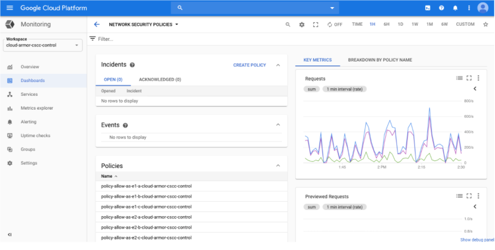

# Google Could Foundation

## Google Cloud (Hereinafter referred to as GC) Overview
- 2008:
    - Launched by Google that runs on the same infrastructure that Google uses internally for its end-user products.
    - Services: Google App Engine, Cloud Storage, Cloud SQL, K8s.
- GC provides PAAS & IAAS, e.g., computing, data storage, data analytics and machine learning.
- [Google Cloud Website](https://cloud.google.com/)

## Design and Structure
- Global Network:
    - a global fiber network that spans:
        - regions, includes many zones, e.g., US-Central-1.
        - zones: data centers., includes many edge locations.
        - edge location: Google responses to the user's request from edge location with lowest latency.
- Security:
    - fiber network rovides a private secure global network that motly does not have to touch the internet.

## What is Google Cloud good at
- Google Security Model
- Private Fiber Global Network
- Machine Learning
- Live Migration

## Identity and Access Management (IAM)

### Functions
- Authorization
- Allows detailed document of any sequence of activities within your account. 
- Granular Access Control

### Console
- IAM & Admin
    - IAM - add/remove member
    - Roles - customize roles

## Resource Hierarchy

- [doc - Best practices for enterprise organizations](https://cloud.google.com/docs/enterprise/best-practices-for-enterprise-organizations#project-structure)

### Organization
- The Organization resource represents an organizstion and is the root node in the GC resource hierarchy.
- This serves as the hierarchical ancestor resource for Folders and Projects. With that being said, you are not required to have an organization.

### Folder
- Can serve as different depts or teams within the company

### Project
- The project organizes all your GC resources, e.g., Production Project.
- A project consists of:
    - users
    - APIs
    - billing,
    - authentication
    - monitoring settings for those APIs

## Virtual Private Cloud (= AWS VPC)

- Virtual Private Cloud (VPC) network is a virtual version of a physical network, implemented inside of Google's production network.
- It associates with region.
- [Google VPC Website](https://cloud.google.com/vpc/)

## Compute Engine (= AWS EC2)

- In used as a serve resources instead of acquiring and managing server hardware.
- OS:
    - Linux
    - Windows
- Machine Type:
    - A set of virtualized hardware resources available to a virtual machine instance, including the system memory size, virtual CPU count, and persistent disk limits.
    - 4 machine types:
        - E type: general purpose, e.g., use e2-micro (2 vCPU, 1 GM memory) for test.
        - M type: memory optimize, e.g., m1-megamem-96 (96 vCPU, 1.4 TP memory)
        - N type: general purpose with balance price
        - C type: compute optimize, e.g., c2-standard-4 (4 vCPU, 16 GB memory)
- [Google Compute Engine Website](https://cloud.google.com/compute/)

## Database

- [Compare Google Database](https://cloud.google.com/products/databases)

### RDBMS
- [Cloud SQL](https://cloud.google.com/sql/)
    - MySQL
    - PostgreSQL
    - SQL Server
- [Cloud Spanner](https://cloud.google.com/spanner/):
    - Fully managed relational database with unlimited scale, strong consistency, and up to 99.999% availability.

### NoSQL
- [BigTable](https://cloud.google.com/bigtable/):
    - A fully managed, scalable NoSQL database service for large analytical and operational workloads.
- [Firestore](https://cloud.google.com/firestore)
    - Easily develop rich applications using a fully managed, scalable, and serverless document database.
- [Memory Store](https://cloud.google.com/memorystore/)
    - Redis
    - Memcache

## BigQuery

- Serverless, highly scalable, and cost-effective multi-cloud data warehouse designed for business agility.
- Charge on usage.
- [Google BigQuery Website](https://cloud.google.com/bigquery/)

## Google Data Flow

- A fully managed service for executing Apache Beam pipelines within the Google Cloud Platform ecosystem
- [Google Dataflow website](https://cloud.google.com/dataflow/)

## Pub/Sub

- Pub/Sub is a fully-managed real-time messaging service that allows you to send and receive messages between independent applications.
- Supports push and pull.
- [Pub/Sub Website](https://cloud.google.com/pubsub/)

## Cloud Monitoring

- Gain visibility into the performance, availability, and health of your applications and infrastructure.
- Key features:
    - [SLO](https://cloud.google.com/blog/products/management-tools/practical-guide-to-setting-slos) monitoring
    - Custom metrics
    - Google Cloud intergration
    - Monitoring agent
    - Logging integration
    - Dashboards
    - Group/cluster support
    - Alerting
    - Uptime monitoring
- [Google Cloud Monitoring Website](https://cloud.google.com/monitoring)

## AI

- AI solutions:
    - [Cloud AutoML](https://cloud.google.com/automl/):
        - Train high-quality custom machine learning models with minimal effort and machine learning expertise.
    - [Cloud Natural Language](https://cloud.google.com/natural-language)
    - [Cloud Translation](https://cloud.google.com/translate)
    - [Vision AI](https://cloud.google.com/vision)
    - [Dialogflow](https://cloud.google.com/dialogflow):
        - AI Chatbot.
- Industry-specific AI solutions:
    - [Contact Center AI](https://cloud.google.com/solutions/contact-center):
        - Google's conversational AI for contact center excellence
    - [Document AI](https://cloud.google.com/document-ai):
        - Unlock insights from documents with machine learning.
- [AI Platform](https://cloud.google.com/ai-platform):
    - AutoML + MLOps + AI Platform (old edition): to train your machine learning models at scale, to host your trained model in the cloud, and to use your model to make predictions about new data.
- [AI Hub](https://cloud.google.com/ai-hub/):
    - Hosted AI repository with one-click deployment for machine learning teams.

## Security
- Data Storage Security: Encryption in Transit and Encryption at Rest.
- Secure Internet Connection.
- Identity and Access Management.

## Keep updates
- If you want to get the updates of GCP, you can refer to [GCP This Month](https://acloud.guru/series/gcp-this-month).

## References
- [acloud guru - Introduction to Google Cloud
](https://acloudguru.com/course/introduction-to-google-cloud)